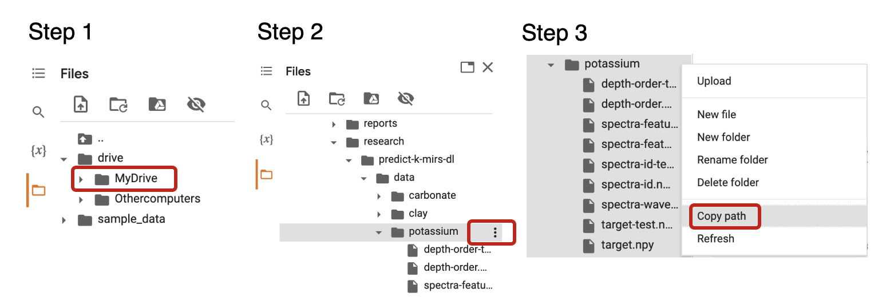

> Prediction of Exchangeable Potassium in Soil through Mid-Infrared
> Spectroscopy and Deep Learning: from Prediction to Explainability,
> Albinet et al., 2022

<!-- WARNING: THIS FILE WAS AUTOGENERATED! DO NOT EDIT! -->

The [mirzai](https://pypi.org/project/mirzai/) Python Package, the
present [documentation](https://fr.anckalbi.net/mirzai/) and associated
notebooks ensure the reproducibility of the above-mentioned [scientific
paper](no-link).

## Paper with code

1.  [Exploratory Data Analysis (Fig. 1)](paper/eda.html)

2.  [Data selection and transformation](paper/select_transform.html)

3.  Baseline model (PLSR):

    - [Learning curve](paper/plsr_learning_curve.html)
    - [Training & evaluation](paper/plsr_train_eval.html)

4.  Convolutional Neural Network (CNN):

    - [Learning rate finder](paper/cnn_lr_finder.html)
    - [Learning curve](paper/cnn_learning_curve.html)
    - [Training & evaluation](paper/cnn_train_eval.html)
    - [Validation curve by Soil Taxonomy Orders (Fig.
      5)](paper/cnn_valid_curve_by_tax.html)

5.  PLSR vs. CNN figures:

    - [Learning curves (Fig. 3)](paper/figures_learning_curves.html)
    - [Observed vs. predicted scatterplots (Fig.
      4)](paper/figures_observed_vs_predicted.html)
    - [Global vs. local modelling (Fig.
      6)](paper/figures_global_vs_local.html)

6.  Interpretability

    - [GradientShap values (Fig.
      7))](paper/interpretation_gradshap.html)
    - [GradientShap values correlation (Fig.
      8)](paper/interpretation_gradshap_corr.html)

## Setup

### Getting the data

A zipped archive of the data used in this study are available for
download at the following link:
<https://drive.google.com/drive/folders/1VGfrBexMPCFvoUa1VW26n-zO9v5WHeFh?usp=sharing>

### In a local environment

The preferred way it to use [Mamba](https://mamba.readthedocs.io). Mamba
is a fast, robust, and cross-platform package manager.

To install the required dependency and proper Python version:

- Clone `git clone git@github.com:franckalbinet/mirzai.git` or download
  the <https://github.com/franckalbinet/mirzai> into your local
  environement
- In `mirzai/` root folder, execute the following Mamba command
  `mamba env create -f environment.yml`

Here below the content of `mirzai/environment.yml` file listing required
Python version and packages:

    name: mirzai
    channels:
      - conda-forge
      - fastchan
      - pytorch
    dependencies:
      - python=3.8
      - nbdev
      - jupyterlab
      - numpy
      - scipy
      - matplotlib=3.5.1
      - scikit-learn
      - pytorch
      - torchvision=0.12.0
      - tqdm
      - captum

- Then activate the Python environement generated:
  `mamba activate mirzai`

- And finally launch `jupyter notebook`

### In Google Colab

Google Colab has been used to perform the experiments described in the
above mentioned paper. The main advantage of Colab is to give access to
a GPU (Graphical Processing Unit) which allows to train Deep Learning
model in a fair amount of time. Please refer to [Colab
FAQ](https://research.google.com/colaboratory/faq.html) for further
information.

Each notebook listed above includes a

link to load it in the Google Colab environment. When clicking on those
links, the notebook will get loaded in Google Colab.

Then, once open in Colab, you will need:

1.  To mount Google drive to access the data uploaded
2.  To install the `mirzai` Python package

These two steps are already included on top of each notebook and will be
executed if on Colab:

    if 'google.colab' in str(get_ipython()):
        from google.colab import drive
        drive.mount('/content/drive',  force_remount=False)
        !pip install mirzai

To locate the Google Drive folder where you uploaded the data, follow
the 3 steps shown below:

1.  Click the “Files” icon in the Colab left panel then click on
    “MyDrive”
2.  Navigate to the directory containing the data then click on the ” 3
    vertical dots” icon
3.  Click on “Copy path” to copy the full path (for instance
    `/content/drive/MyDrive/research/predict-k-mirs-dl/data`)

Last, when a GPU is required (e.g when training the Convolutional Neural
Network or computing the GradientShap values), change runtime type in
`Colab` top menu: Runtime ▶ Change runtime type ▶ and select `GPU` in
the “Hardware accelerator” select box.

## Acknowledgements

*This work was carried out in the context of the IAEA funded Coordinated
Research Project (CRP D1.50.19) titled [“Remediation of Radioactive
Contaminated Agricultural
Land”](https://www.iaea.org/projects/crp/d15019), under IAEA Technical
Contract n°23685.*

*We also thank Richard Ferguson from Kellogg Soil Survey Laboratory for
providing access to the USDA MIR soil spectra library and the r equired
training sessions for its operation.*

## Others

The name `mirzai` comes from Mid-InfraRed Spectroscopy with AI but also
is a way to pay tribute to [Nino Ferrer’s song
“Mirza”](https://www.youtube.com/watch?v=5PN2yfuzgQY)
